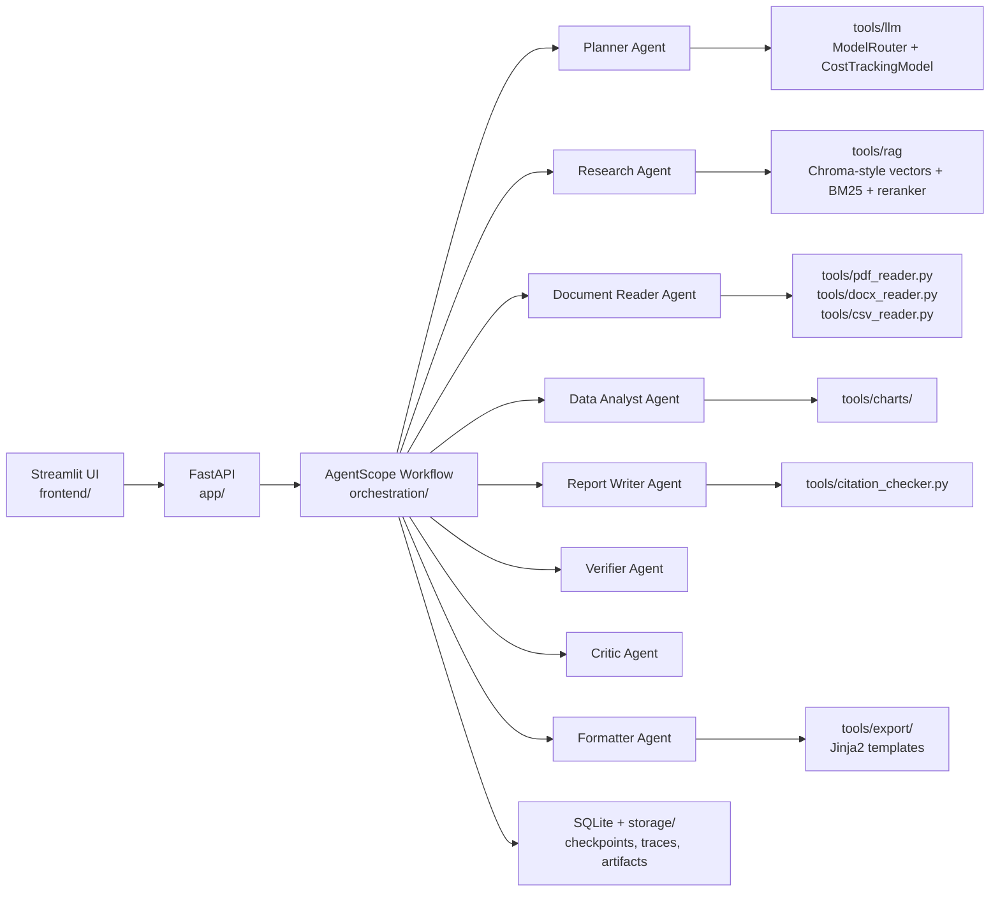

# ReportForge

Local-first multi-agent report generation for structured, citation-grounded business reports.


## Architecture



## Quickstart

```bash
cp .env.example .env
docker compose up --build
```

Services:

- API: `http://localhost:8000`
- Healthcheck: `http://localhost:8000/health`
- Streamlit: `http://localhost:8501`

Local development:

```bash
uv sync
uv run uvicorn app.main:app --reload
uv run streamlit run frontend/streamlit_app.py
```

## Configuration

| Variable | Default | Purpose | Free-tier behavior | Production switch |
|---|---:|---|---|---|
| `ACTIVE_LLM_PROVIDER` | `gemini` | Active provider for `ModelRouter` | Gemini Flash by default | Set `kimi`, `groq`, or `ollama` |
| `GEMINI_API_KEY` | empty | Gemini API key | 1,500 req/day quota guard | Required for Gemini |
| `GEMINI_MODEL_NAME` | `gemini-1.5-flash` | Gemini model | Zero actual cost logs | Swap via env only |
| `GROQ_API_KEY` | empty | Groq debug fallback | 1M tok/day quota guard | Optional |
| `OLLAMA_MODEL_NAME` | `llama3.1:8b` | Local model | No-op quota, zero cost | Use with Ollama sidecar |
| `KIMI_API_KEY` | empty | Kimi production key | Blocked when cost guard is zero | Enable with positive cost guard |
| `MAX_COST_USD_PER_JOB` | `0.00` | Hard cost ceiling | Blocks Kimi | Set positive budget |
| `ENABLE_COST_PREVIEW` | `true` | Show cost preview | Computes Kimi estimates | Keep enabled |
| `STORAGE_DIR` | `./storage` | Runtime artifact root | Local only | Mount persistent volume |
| `DATABASE_URL` | SQLite | Job/traces/checkpoints | Local SQLite | Postgres path in V2 |

## API

Create a job:

```bash
curl -X POST http://localhost:8000/jobs \
  -H 'Content-Type: application/json' \
  -d '{"topic":"AI reporting","type":"market_research","depth":"standard"}'
```

Get full job:

```bash
curl http://localhost:8000/jobs/{job_id}
```

Get progress:

```bash
curl http://localhost:8000/jobs/{job_id}/progress
```

List sections:

```bash
curl http://localhost:8000/jobs/{job_id}/sections
```

List sources:

```bash
curl http://localhost:8000/jobs/{job_id}/sources
```

Regenerate a section:

```bash
curl -X POST 'http://localhost:8000/jobs/{job_id}/regenerate-section?section_id=summary&feedback=tighter'
```

Export a report:

```bash
curl http://localhost:8000/jobs/{job_id}/export/markdown
curl http://localhost:8000/jobs/{job_id}/export/pdf
curl http://localhost:8000/jobs/{job_id}/export/docx
```

Get traces:

```bash
curl http://localhost:8000/jobs/{job_id}/traces
```

Cost dashboard:

```bash
curl http://localhost:8000/costs/summary
```

Approve HITL gate:

```bash
curl -X POST http://localhost:8000/jobs/{job_id}/approve
```

Retry after failure:

```bash
curl -X POST http://localhost:8000/jobs/{job_id}/retry
```

## Agent Catalog

| Agent | Purpose | LLM | Input Schema | Output Schema |
|---|---|---|---|---|
| Planner | Outline and research questions | Gemini via ModelRouter | topic/type/depth | `PlannerOutput` |
| Research | Mock/Tavily source collection | Gemini via ModelRouter | topic/job | `ResearchOutput` |
| Document Reader | Parse uploads into evidence | None | file paths | `DocumentReaderOutput` |
| Data Analyst | Generate chart artifacts and insights | None | CSV/XLSX path | chart/insight dict |
| Report Writer | Draft section-by-section | Gemini via ModelRouter | `WriterInput` | `WriterOutput` |
| Verifier | Audit claims and export blockers | Gemini via ModelRouter | claims | `VerifierOutput` |
| Critic | Score quality and fixes | Gemini via ModelRouter | markdown | `CriticOutput` |
| Formatter | Produce Markdown/PDF/DOCX artifacts | None | sections/job | `FormatterOutput` |

## Cost Guide

Free tier:

- Gemini 1.5 Flash: actual cost logged as `$0.00`, guarded at 1,500 requests/day.
- Groq debug fallback: actual cost logged as `$0.00`, guarded at 1M tokens/day.
- Ollama: local fallback, unlimited by quota manager.

Kimi K2.6 migration estimates are logged through `estimated_kimi_cost_usd`:

| Depth | Typical use | Production estimate |
|---|---|---|
| Brief | 2-3 pages | Low, section-light report |
| Standard | 5-8 pages | Medium, default planning target |
| Deep | 10-15 pages | High, requires HITL approval |

`MAX_COST_USD_PER_JOB=0.00` blocks Kimi instantiation during testing.

## Development

Branch strategy:

- `001-scaffold-and-schemas`: Spec Kit and constitution.
- `002-report-generation-platform`: specification, plan, contracts, tasks.
- `003-rag-pipeline`: implementation scaffold and cross-cutting refinements.

Checks:

```bash
uv run pytest
uv run ruff check .
docker compose config --quiet
docker build -t reportforge:local .
```

## Troubleshooting

Checkpoint recovery:

- Use `POST /jobs/{job_id}/retry`.
- Check `storage/checkpoints/` for saved workflow state.

HITL gate:

- Investment Memo, Policy Brief, and Deep reports require approval.
- Use `POST /jobs/{job_id}/approve`.

Provider switch:

- Set `ACTIVE_LLM_PROVIDER=gemini`, `groq`, `ollama`, or `kimi`.
- Kimi requires `MAX_COST_USD_PER_JOB` greater than zero.

Quota exceeded:

- Gemini and Groq counters are SQLite-backed.
- Quota errors should fail fast rather than retry.

Common errors:

- Missing `GEMINI_API_KEY`: mock/local paths still work, real Gemini calls will not.
- Docker healthcheck fails: inspect `docker compose logs api`.
- Streamlit exits: run `uv sync` and confirm `streamlit` is installed.

## License

MIT
