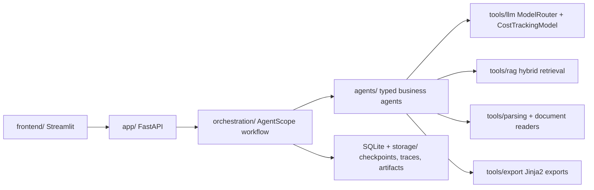

# ReportForge

A local-first, multi-agent report generation platform for citation-grounded
business reports.

## Architecture



Business logic lives in `agents/` and `tools/`. `orchestration/` coordinates
pipelines and checkpoints only. Model providers are selected through
`tools/llm/ModelRouter`, never imported directly by agents.

## Setup

```bash
uv sync
```

## Run

```bash
uv run reportforge
```

## API

```bash
uv run uvicorn app.main:app --reload
```

## Test and lint

```bash
uv run pytest
uv run ruff check .
```

## Docker

```bash
docker build -t reportforge .
docker run --rm reportforge
```

Or with Compose:

```bash
docker compose up --build
```
