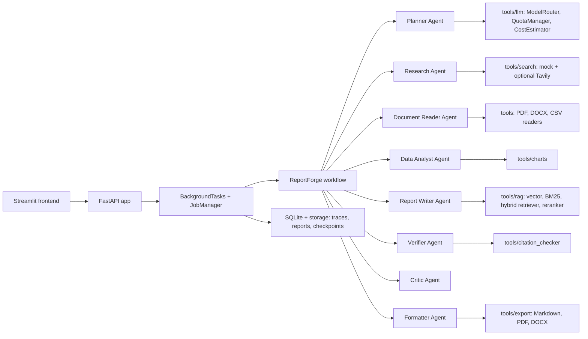

# ReportForge

Local-first multi-agent report generation for structured, citation-grounded business reports.


## Architecture



## Quickstart

```bash
cp .env.example .env
docker compose up --build
```

Services:

- FastAPI: `http://localhost:8000`
- Streamlit: `http://localhost:8501`
- Healthcheck: `http://localhost:8000/health`

Local development:

```bash
uv sync
uv run uvicorn app.main:app --reload
REPORTFORGE_API_URL=http://localhost:8000 uv run streamlit run frontend/streamlit_app.py
```

## Configuration

| Variable | Free tier | Production |
|---|---|---|
| `ACTIVE_LLM_PROVIDER` | `gemini`, `groq`, or `ollama` | Set `kimi` after raising cost guard |
| `GEMINI_API_KEY` | Gemini Flash key, guarded at 1,500 req/day | Required for Gemini-backed agents |
| `GROQ_API_KEY` | Optional debug fallback, guarded at 1M tok/day | Required when `ACTIVE_LLM_PROVIDER=groq` |
| `GROQ_MODEL_NAME` | `llama-3.3-70b-versatile` | Groq model selection |
| `OLLAMA_BASE_URL` | `http://localhost:11434` | Use `http://host.docker.internal:11434` from Docker |
| `OLLAMA_MODEL_NAME` | `llama3.1:8b` local fallback | Use local/sidecar Ollama |
| `KIMI_API_KEY` | Not used while cost guard is zero | Required for Kimi |
| `MAX_COST_USD_PER_JOB` | `0.00`, blocks Kimi | Positive budget enables Kimi routing |
| `ENABLE_COST_PREVIEW` | `true`, logs Kimi-equivalent estimate | Keep enabled |
| `STORAGE_DIR` | `./storage` | Persistent volume |
| `DATABASE_URL` | `sqlite:///./storage/reportforge.db` | Postgres migration path planned |
| `REPORTFORGE_API_URL` | Streamlit backend URL | Set to deployed API URL |

## API

Health:

```bash
curl http://localhost:8000/health
```

Create a job:

```bash
curl -X POST http://localhost:8000/jobs \
  -H 'Content-Type: application/json' \
  -d '{"topic":"AI reporting","type":"market_research","depth":"standard"}'
```

Job status and progress:

```bash
curl http://localhost:8000/jobs/{job_id}
curl http://localhost:8000/jobs/{job_id}/progress
curl http://localhost:8000/jobs/{job_id}/progress/stream
```

Report data:

```bash
curl http://localhost:8000/jobs/{job_id}/sections
curl http://localhost:8000/jobs/{job_id}/sources
curl http://localhost:8000/jobs/{job_id}/traces
```

Mutation:

```bash
curl -X POST 'http://localhost:8000/jobs/{job_id}/regenerate-section?section_id={section_id}&feedback=tighter'
curl -X POST http://localhost:8000/jobs/{job_id}/approve
curl -X POST http://localhost:8000/jobs/{job_id}/retry
```

Exports:

```bash
curl http://localhost:8000/jobs/{job_id}/export/markdown
curl http://localhost:8000/jobs/{job_id}/export/pdf --output report.pdf
curl http://localhost:8000/jobs/{job_id}/export/docx --output report.docx
```

Cost and quota:

```bash
curl http://localhost:8000/costs/summary
curl http://localhost:8000/costs/quota
```

## Agent Catalog

| Agent | Purpose | Default LLM | Input Schema | Output Schema |
|---|---|---|---|---|
| Planner | Create depth-aware outline and research questions | Gemini Flash via ModelRouter | `ReportJob` | `PlannerOutput` |
| Research | Collect mock/Tavily-ready sources | Gemini Flash via ModelRouter | job id + topic | `ResearchOutput` |
| Document Reader | Extract uploaded evidence | None | file paths | `DocumentReaderOutput` |
| Data Analyst | Summarize CSV data and chart artifacts | None | CSV path | chart/insight dict |
| Report Writer | Draft sections using bounded evidence | Gemini Flash via ModelRouter | `WriterInput` | `WriterOutput` |
| Verifier | Check claim-source support and blockers | Gemini Flash via ModelRouter | `ReportSection`, `Source[]` | `VerifierOutput` |
| Critic | Score quality and suggest fixes | Gemini Flash via ModelRouter | markdown | `CriticOutput` |
| Formatter | Generate Markdown/PDF/DOCX artifacts | None | job id + markdown | `FormatterOutput` |

## Cost Guide

Free tier:

- Gemini 1.5 Flash: `$0.00` actual cost, 1,500 requests/day guard.
- Groq fallback: `$0.00` actual cost, 1M tokens/day guard.
- Ollama: local fallback, no network quota.

Production Kimi estimates are recorded in `estimated_kimi_cost_usd` while actual free-tier cost stays `$0.00`.

| Depth | Target size | Kimi migration estimate |
|---|---|---|
| Brief | 2-3 pages | Lowest; small outline and few sections |
| Standard | 5-8 pages | Medium; default report path |
| Deep | 10-15 pages | Highest; requires HITL approval |

## Development

Branch strategy:

- `001-scaffold-and-schemas`: constitution and scaffold.
- `002-report-generation-platform`: spec, plan, contracts, tasks.
- `003-rag-pipeline`: implementation, integration, and hardening.

Checks:

```bash
uv run pytest
uv run ruff check .
docker compose config --quiet
```

## Troubleshooting

Checkpoint recovery:

- Use `POST /jobs/{job_id}/retry`.
- Check `storage/checkpoints/` for saved state.

HITL:

- Investment Memo, Policy Brief, and Deep reports pause at `awaiting_approval`.
- Use `POST /jobs/{job_id}/approve`.

Provider switch:

- Change `ACTIVE_LLM_PROVIDER`.
- Kimi is blocked until `MAX_COST_USD_PER_JOB` is greater than `0.00`.

Quota exceeded:

- API returns 429 for free-tier quota exhaustion.
- Inspect `/costs/quota` for remaining Gemini/Groq quota.

Common errors:

- Backend unavailable in Streamlit: set `REPORTFORGE_API_URL`.
- Healthcheck fails: run `docker compose logs api`.
- Export blocked: verifier found unsupported or contradicted claims.

## License

MIT
