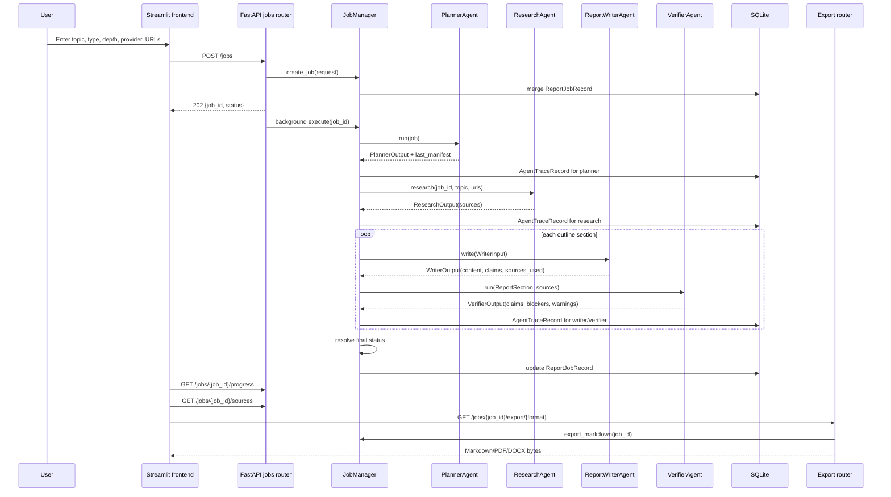

# ReportForge Code Workflow Map

Generated with Graphify-assisted exploration on 2026-06-05.

This document describes how ReportForge works end to end, which files connect to
which parts of the workflow, and where to look when making changes. It combines
Graphify relationship queries with direct source inspection.

## Graphify Commands Used

Use these commands to reproduce or extend the map:

```bash
graphify query "Trace the full report job workflow from Streamlit UI submission through FastAPI routes, job registry, agents, section generation, verification, export, and persistence" --budget 7000
graphify query "JobRegistry WorkflowState create_job run_report_workflow agent orchestration connections" --budget 5000
graphify query "frontend streamlit submit_job poll_job render_progress render_sources render_report API endpoints connections" --budget 5000
graphify query "export_report write_docx write_pdf markdown export sources sections connections" --budget 5000
graphify query "DocumentReaderAgent DataAnalystAgent csv pdf docx rag search chart generation auxiliary tools connections" --budget 6000
```

Useful focused follow-ups:

```bash
graphify explain "JobManager"
graphify explain "ReportWriterAgent"
graphify explain "VerifierAgent"
graphify path "frontend/streamlit_app.py" "app/routers/jobs.py"
graphify path "create_job()" "JobManager"
graphify path "export_report()" "write_pdf()"
```

After code edits, refresh the local graph:

```bash
graphify update .
```

## One-Screen Summary

ReportForge is a local-first, citation-grounded report generator. The user enters
a topic, report type, depth, provider, and source URLs in the Streamlit frontend.
The frontend calls FastAPI. FastAPI stores an in-memory job in `JobManager`, kicks
off a background task, and exposes progress, sections, sources, traces, exports,
costs, and approval endpoints.

The active report generation path is:

```text
frontend/streamlit_app.py
  -> app/routers/jobs.py
    -> app/services/job_registry.py
      -> orchestration/job_manager.py
        -> PlannerAgent
        -> ResearchAgent
        -> ReportWriterAgent
        -> VerifierAgent
        -> render_markdown / write_pdf / write_docx through export routes
        -> SQLite job and trace records
```

There is also a separate checkpoint-oriented facade in
`orchestration/workflow.py`. It is covered by integration tests and coordinates
`PlannerAgent`, `ResearchAgent`, `ReportWriterAgent`, `VerifierAgent`, and
`CriticAgent`, but the FastAPI background route currently uses `JobManager.run_job`
instead.

## Main Runtime Sequence



## Startup and Application Shell

### `app/main.py`

`create_app()` builds the FastAPI app and registers routers:

- `app.routers.jobs`
- `app.routers.sections`
- `app.routers.export`
- `app.routers.costs`

The lifespan hook initializes runtime infrastructure:

- `configure_logging()`
- `StorageManager().ensure()`
- `init_db()`
- `ModelRouter()`
- `app.state.active_model`
- `app.state.shutting_down`

It also installs normalized exception handlers:

- 404 returns `{"detail": ...}`
- request validation returns 422 with validation detail
- `QuotaExceededError` returns 429
- unhandled exceptions return a generic 500 and are logged

`GET /health` creates a model router, resolves a model, and returns status,
provider, model name, and `model_ready`.

### `tools/storage.py`

`StorageManager.ensure()` creates these runtime directories:

- `storage/uploads`
- `storage/reports`
- `storage/charts`
- `storage/indexes`
- `storage/checkpoints`
- `storage/llm_logs`

`StorageManager.job_dir(job_id, area)` creates and returns a job-scoped artifact
directory under the configured storage root.

### `app/config.py`

Configuration is loaded from environment variables through `Settings`.

Important fields:

- `ACTIVE_LLM_PROVIDER`, default `gemini`
- `GEMINI_API_KEY`, `GEMINI_MODEL_NAME`
- `GROQ_API_KEY`, `GROQ_MODEL_NAME`
- `OLLAMA_BASE_URL`, `OLLAMA_MODEL_NAME`, `OLLAMA_TIMEOUT_SECONDS`
- `KIMI_API_KEY`, `KIMI_MODEL_NAME`
- `MAX_COST_USD_PER_JOB`, default `0.0`
- `GEMINI_DAILY_REQUEST_LIMIT`, default `1500`
- `GROQ_DAILY_TOKEN_LIMIT`, default `1000000`
- `STORAGE_DIR`, default `./storage`
- `DATABASE_URL`, default `sqlite:///./storage/reportforge.db`

`get_settings()` is cached with `lru_cache`.

## Frontend Workflow

### `frontend/streamlit_app.py`

The frontend uses the standard library `urllib` rather than a generated API
client. `API_BASE_URL` defaults to `http://localhost:8000` and can be overridden
with `REPORTFORGE_API_URL`.

Main helpers:

- `api_json(method, path, payload)` sends JSON requests to FastAPI.
- `api_bytes(path)` downloads export bytes.
- `safe_api_json(...)` converts `HTTPError` and `URLError` into user-visible
  dictionaries.
- `submit_job(...)` builds the `POST /jobs` payload and returns `(job_id, error)`.
- `poll_job(job_id)` calls `GET /jobs/{job_id}/progress`.

The UI flow:

1. Sidebar lets the user choose report type, depth, and provider.
2. Sidebar accepts uploaded files, but the current submit payload does not send
   those uploaded files to the backend yet.
3. Sidebar accepts URLs as newline-separated text.
4. Sidebar calls `GET /costs/quota` and displays remaining Gemini/Groq quota.
5. The main body accepts a topic.
6. `Generate report` calls `submit_job`.
7. On success, the returned job ID is stored in `st.session_state.jobs`.
8. The selected job is polled through `poll_job`.
9. `render_progress` displays status, active agent, current step, cost, and
   percent complete.
10. Running and pending jobs sleep for two seconds, then rerun the Streamlit app.
11. Completed, failed, or approval-gated jobs render sources, report preview,
    export buttons, and section editor controls.

Frontend endpoint connections:

```text
submit_job()
  -> POST /jobs
  -> app/routers/jobs.py:create_job()

poll_job()
  -> GET /jobs/{job_id}/progress
  -> app/routers/jobs.py:get_progress()

render_sources()
  -> GET /jobs/{job_id}/sources
  -> app/routers/jobs.py:list_sources()

render_report()
  -> GET /jobs/{job_id}/export/markdown
  -> app/routers/export.py:export_report()

render_exports()
  -> GET /jobs/{job_id}/export/markdown
  -> GET /jobs/{job_id}/export/pdf
  -> GET /jobs/{job_id}/export/docx
  -> app/routers/export.py:export_report()

render_section_editor()
  -> GET /jobs/{job_id}/sections
  -> POST /jobs/{job_id}/regenerate-section
  -> app/routers/sections.py
```

If `progress.status == awaiting_approval`, the UI shows an approval button that
calls `POST /jobs/{job_id}/approve`.

## API Routers

### `app/routers/jobs.py`

This router owns job creation, job snapshots, progress, server-sent progress,
sources, and traces.

Endpoints:

- `POST /jobs`
  - Validates `CreateJobRequest`.
  - Calls `manager.create_job(request)`.
  - Adds `manager.execute(job_id)` as a FastAPI background task.
  - Returns `CreateJobResponse` with 202.

- `GET /jobs/{job_id}`
  - Returns `manager.get_job(job_id).model_dump()`.

- `GET /jobs/{job_id}/progress`
  - Returns the lightweight `JobProgress` object from `manager.progress(job_id)`.

- `GET /jobs/{job_id}/progress/stream`
  - Emits server-sent events when progress changes.
  - Stops when status is `completed`, `failed`, or `awaiting_approval`.
  - Emits a final `done` event.

- `GET /jobs/{job_id}/sources`
  - Returns `Source` objects as dictionaries.

- `GET /jobs/{job_id}/traces`
  - Returns `AgentTrace` objects as dictionaries.

All job-specific endpoints check `job_id in manager.jobs` and return 404 when
the job is unknown.

### `app/routers/sections.py`

This router operates under `/jobs/{job_id}`.

Endpoints:

- `GET /sections`
  - Returns `manager.list_sections(job_id)`.

- `POST /regenerate-section`
  - Accepts `section_id` and optional `feedback` as query parameters.
  - Calls `manager.regenerate_section(job_id, section_id, feedback)`.
  - Appends feedback to section content and marks the section `regenerated`.

- `POST /approve`
  - Calls `manager.approve(job_id)`.
  - Marks approval-gated reports completed.

- `POST /retry`
  - Calls `manager.retry(job_id)`.
  - Re-runs the in-memory workflow.

### `app/routers/export.py`

This router operates under `/jobs/{job_id}`.

Endpoint:

- `GET /export/{format}`
  - Supports `markdown`, `pdf`, and `docx`.
  - Rejects unknown formats with 400.
  - Calls `manager.export_markdown(job_id)`.
  - If `manager.export_markdown` raises `ValueError`, returns 409. This happens
    when unsupported or contradicted claims block export.
  - For Markdown, returns `text/markdown`.
  - For PDF, writes `storage/reports/{job_id}.pdf` through `write_pdf`.
  - For DOCX, writes `storage/reports/{job_id}.docx` through `write_docx`.

### `app/routers/costs.py`

Endpoints:

- `GET /costs/summary`
  - Returns aggregate in-memory job count, tokens, zero actual cost, and Kimi
    estimate.

- `GET /costs/quota`
  - Returns daily Gemini and Groq quota counters from `QuotaManager`.

## Core Runtime Owner

### `app/services/job_registry.py`

This file creates the shared router-level singleton:

```python
manager = JobManager()
```

All routers import this same manager. That means active jobs, sources, traces,
progress, URLs, and selected providers are held in process memory. SQLite stores
job records and trace records, but the primary route lookup is still in-memory.
Restarting the API process loses `manager.jobs` unless rehydration is added.

### `orchestration/job_manager.py`

`JobManager` is the active workflow owner used by FastAPI.

In-memory indexes:

- `jobs: dict[str, ReportJob]`
- `sources_by_job: dict[str, list[Source]]`
- `traces_by_job: dict[str, list[AgentTrace]]`
- `progress_by_job: dict[str, JobProgress]`
- `urls_by_job: dict[str, list[str]]`
- `providers_by_job: dict[str, str]`

#### `create_job`

Inputs:

- `CreateJobRequest`
- optional `session_id`, default `anonymous`

Actions:

1. Creates a UUID job ID.
2. Creates a `ReportJob` with `PENDING` status.
3. Stores empty sources, traces, URLs, provider, and progress in memory.
4. Persists a `ReportJobRecord` to SQLite with status, type, depth, cost, and
   timestamps.
5. Returns `CreateJobResponse`.

#### `execute`

FastAPI calls `manager.execute(job_id)` in the background. This delegates to
`run_job(job_id)`.

#### `run_job`

This is the primary report generation workflow.

1. Resolve the job and selected provider.
2. Build a provider-specific `ModelRouter` by copying settings and overriding
   `active_llm_provider`.
3. Set progress to:
   - status `running`
   - active agent `PlannerAgent`
   - step `planning outline`
   - percent `10.0`
4. Instantiate `PlannerAgent(router)`.
5. Call `planner.run(job)`.
6. Append a `PlannerAgent` trace.
7. Set progress to:
   - active agent `ResearchAgent`
   - step `collecting sources`
   - percent `30.0`
8. Call `ResearchAgent(router).research(job_id, job.topic, urls)`.
9. Store `research_output.sources` in `sources_by_job`.
10. Append a `ResearchAgent` trace.
11. Create a `ReportWriterAgent(router)`.
12. Create a `VerifierAgent(router, use_llm=False)`.
13. Convert each source into writer evidence strings:
    - citation key
    - title
    - URL
    - raw text
14. For each planned section:
    - Compute a stable section ID.
    - Update progress to `ReportWriterAgent`.
    - Build `WriterInput`.
    - Include the section plan and rolling summary through
      `_writer_context(planner, section_title, previous_sections)`.
    - Call `writer.write(...)`.
    - Map writer claim citation keys to source IDs through `_source_ids_for_claim`.
    - Append a `ReportWriterAgent` trace.
    - Build a draft `ReportSection`.
    - Update progress to `VerifierAgent`.
    - Call `verifier.run(draft_section, sources)`.
    - Append a `VerifierAgent` trace.
    - Collect verifier blockers.
    - Mark the section `blocked` if blockers exist, otherwise `drafted`.
15. Resolve final job status:
    - `failed` if any verifier blockers exist.
    - `awaiting_approval` if `requires_approval(job.type, job.depth)` is true.
    - otherwise `completed`.
16. Attach all sections to the job.
17. Set `completed_at` unless status is `awaiting_approval`.
18. Set final progress to 100 percent.
19. Persist final job status to SQLite.

If any exception is raised during the workflow:

1. Log `job_failed`.
2. Set `job.status = FAILED`.
3. Set progress to `FAILED` at 100 percent with the exception string as the
   current step.
4. Persist the failed status.

#### Important behavior when no usable sources are collected

`ResearchAgent.research` returns an empty source list when no URLs are supplied.
Then:

1. The writer receives no evidence.
2. The writer emits an "Insufficient evidence" section and an unverified claim.
3. `_source_ids_for_claim` cannot map any source IDs.
4. The verifier sees no candidate sources and marks the claim unsupported.
5. `validate_claim_sources` returns blockers.
6. `JobManager._final_status` sets the job to `failed`.

So source URLs are required for a successful active end-to-end report in the
current implementation.

#### Traces and cost rollup

`_append_trace` creates an `AgentTrace` with:

- UUID trace ID
- job ID
- agent name
- input text
- output text
- token count estimated as input words plus output words
- Kimi estimate at `0.000002` per token
- timestamp

It appends the trace in memory, updates the job cost through `_rollup_cost`, and
persists an `AgentTraceRecord` to SQLite.

`_rollup_cost` aggregates all traces for the job and returns `CostMetrics`:

- prompt tokens are total trace tokens
- completion tokens are currently zero
- actual estimated cost is `0.00`
- Kimi estimate is the trace estimate sum
- model name comes from the selected provider settings

#### Section regeneration

`regenerate_section` is currently a deterministic marker operation, not a full
agent rewrite. It:

1. Finds the section by ID.
2. Appends `Reviewer feedback addressed: {feedback}` to the content.
3. Marks status as `regenerated`.
4. Appends a `SectionRegenerator` trace.

#### Approval and retry

`approve(job_id)` marks an approval-gated job completed and persists it.

`retry(job_id)` calls `run_job(job_id)` again using the current in-memory job.

## Data Contracts

### Request and response schemas

`schemas/api.py` defines:

- `CreateJobRequest`
  - `topic`: string, minimum length 3
  - `type`: `ReportType`
  - `depth`: `ReportDepth`
  - `urls`: list of strings, default empty
  - `provider`: `gemini`, `groq`, `ollama`, or `kimi`

- `CreateJobResponse`
  - `job_id`
  - `status`
  - `estimated_cost_usd`, default `0.0`
  - `estimated_kimi_cost_usd`, default `0.0`

- `JobProgress`
  - `job_id`
  - `status`
  - `active_agent`
  - `current_step`
  - `percent_complete`, bounded 0 to 100
  - `cost`

All these schemas use `extra="forbid"`.

### Report schemas

`schemas/reports.py` defines:

- `ReportType`
  - `market_research`
  - `company_profile`
  - `technical_report`
  - `investment_memo`
  - `competitive_analysis`
  - `policy_brief`
  - `literature_review`

- `ReportDepth`
  - `brief`
  - `standard`
  - `deep`

- `ReportStatus`
  - `pending`
  - `running`
  - `awaiting_approval`
  - `completed`
  - `failed`

- `ReportSection`
  - section identity and job ID
  - title, content, order, status
  - source IDs
  - claims
  - chart paths

- `ReportJob`
  - job identity and topic
  - type and depth
  - status and cost
  - created/completed timestamps
  - session ID
  - generated sections

### Source and claim schemas

`schemas/sources.py` defines:

- `VerificationStatus`
  - `SUPPORTED`
  - `PARTIALLY_SUPPORTED`
  - `UNSUPPORTED`
  - `CONTRADICTED`
  - `UNVERIFIED`

- `Source`
  - ID, job ID, title, URL, date, summary, relevance score, raw text, citation key
  - citation keys must be bracketed, such as `[Example1]`

- `EvidenceChunk`
  - retrievable source text chunk with source ID and relevance

- `Claim`
  - ID, section ID, text, source IDs, verification status, confidence
  - `blocks_export` is true for `UNSUPPORTED` and `CONTRADICTED`

### Agent outputs

`schemas/agent_outputs.py` defines:

- `PlannerOutput`
- `ResearchOutput`
- `DocumentReaderOutput`
- `WriterInput`
- `WriterOutput`
- `VerifierOutput`
- `CriticOutput`
- `FormatterOutput`

These are the typed handoff points between agents and orchestration.

## Agent Layer

### `PlannerAgent`

Purpose:

- Convert a topic, report type, and depth into a research-ready plan.
- Preserve backward compatibility by returning `PlannerOutput`.
- Store richer structured detail in `last_manifest`.

Important structures:

- `PlannedSection`
  - section ID
  - title
  - purpose
  - research questions
  - search queries
  - required evidence
  - preferred source types
  - avoid rules
  - target words

- `PlanManifest`
  - job ID, topic, report type, depth
  - target word count
  - sections
  - global research questions
  - source strategy
  - assumptions and warnings
  - fallback flag

Workflow:

1. Build a strict JSON planner prompt.
2. Call the routed model through `CostTrackingModel`.
3. Parse the first JSON object from the response.
4. Normalize the payload into a `PlanManifest`.
5. If parsing fails, ask the model for a corrected JSON response.
6. If correction also fails and fallback is allowed, create a deterministic
   fallback manifest.
7. Enforce section count and word target by depth:
   - brief: 2 to 3 sections, 1200 words
   - standard: 5 to 7 sections, 3500 words
   - deep: 8 to 12 sections, 8000 words
8. Convert manifest into `PlannerOutput`.

Connection to writer:

- `JobManager._writer_context` calls `planner.section_plan_for_writer`.
- That serializes the section plan as JSON into `WriterInput.rolling_summary`.
- `ReportWriterAgent` extracts this JSON with `_extract_section_plan`.

### `ResearchAgent`

Purpose:

- Collect external URL-backed sources.
- Avoid fake evidence by default.
- Deduplicate and normalize URLs.
- Fetch safe public pages.
- Extract source text.
- Score relevance against the topic.
- Return `ResearchOutput(sources=...)`.

Workflow:

1. Normalize and deduplicate URLs.
2. If no URLs are supplied:
   - log a warning
   - return empty sources unless `allow_mock_sources=True`
3. For each URL:
   - create a citation key from the domain plus index
   - call `fetch_url_text`
   - clean extracted text
   - reject low-quality text
   - extract topic-relevant sentence excerpts
   - compute relevance score
   - reject low relevance
   - build a `Source` with ID, title, URL, summary, score, raw text, citation key
4. If URLs were supplied but none are usable:
   - raise `ResearchAgentError` by default

Connection to URL fetcher:

- `ResearchAgent` imports `fetch_url_text` from `tools/search/url_fetcher.py`.
- The fetcher normalizes URLs, blocks private/loopback hosts, follows redirects
  safely, bounds downloads, extracts HTML/PDF/plain text, and rejects blocked or
  too-short content.

### `ReportWriterAgent`

Purpose:

- Draft one report section at a time using only supplied evidence.
- Avoid fabricated citations.
- Validate model output before accepting it.
- Fall back to conservative evidence-derived prose when needed.
- Extract claims and support scores.

Workflow:

1. Extract optional section plan JSON from `WriterInput.rolling_summary`.
2. Build dynamic topic terms from:
   - section title
   - rolling summary
   - section research questions
   - required evidence
3. Convert raw evidence strings into cited sentence-level `EvidenceChunk` items.
4. Select evidence chunks by relevance while preserving source diversity.
5. If no evidence chunks are available:
   - return an insufficient-evidence section
   - return an unverified claim
6. Build a strict JSON-only writer prompt.
7. Call the routed model through `CostTrackingModel`.
8. Parse JSON into `WriterDraft`.
9. Keep only model sentences that:
   - have citation keys
   - cite allowed sources
   - score above the support threshold
10. If model content is invalid, too thin, citation-free, or low-diversity, use
    `_compose_grounded_section`.
11. Extract claim objects from citation-aware sentences.
12. Compute rough support scores by matching claim terms and numbers against the
    cited evidence.
13. Return `WriterOutput(section_title, content, claims, sources_used)`.

Important guardrails:

- Uncited model sentences are discarded.
- Unknown citation keys are discarded.
- Citation markers alone do not prove support.
- Numbers in claims must appear in cited evidence.
- Boilerplate fragments are filtered from evidence.
- Fallback prose uses evidence text directly.

### `VerifierAgent`

Purpose:

- Audit claims against collected sources.
- Return blockers and warnings.
- Optionally use an LLM after deterministic candidate retrieval.

Active FastAPI behavior:

- `JobManager` instantiates `VerifierAgent(router, use_llm=False)`.
- That means the main API workflow uses deterministic verification only.

Workflow:

1. Build source indexes by source ID and citation key.
2. For each claim:
   - resolve explicit source IDs
   - resolve citation keys found inside claim text
   - if no explicit candidate exists, rank all sources by support score
3. If no candidate source exists, mark claim `UNSUPPORTED`.
4. Build compact evidence snippets from candidate sources.
5. Run deterministic verification:
   - numeric mismatch can produce `CONTRADICTED`
   - high support score produces `SUPPORTED`
   - medium support score produces `PARTIALLY_SUPPORTED`
   - low support score produces `UNSUPPORTED`
6. If LLM verification is enabled:
   - ask the model for JSON status and confidence
   - combine deterministic and LLM verdicts conservatively
7. Run `validate_claim_sources`.
8. Return `VerifierOutput(claims, blockers, warnings)`.

Export blocking:

- `UNSUPPORTED` and `CONTRADICTED` claims become blockers.
- `PARTIALLY_SUPPORTED` and `UNVERIFIED` become warnings.
- `SUPPORTED` claims with no source IDs also become blockers.

### `CriticAgent`

Purpose:

- Review final report quality and suggest fixes.

Connections:

- Used by `orchestration/workflow.py` in the checkpoint facade.
- Not currently used by `JobManager.run_job`.

Checks:

- Empty or very short report
- unresolved placeholders
- missing citations
- unknown citations
- low citation density
- missing core report sections
- verifier warnings/blockers
- weak contradiction-like phrasing
- optional LLM critique with source and verifier summaries

### `FormatterAgent`

Purpose:

- Safely write Markdown, PDF, and DOCX artifact files.

Connections:

- Imports `write_pdf` and `write_docx`.
- Covered by export tests.
- Not currently used by the FastAPI export endpoint, which calls `write_pdf` and
  `write_docx` directly.

Safety behavior:

- Sanitizes job IDs.
- Validates non-empty Markdown.
- Rejects unresolved placeholders.
- Normalizes requested formats.
- Prevents path traversal.
- Writes text and binary artifacts atomically.
- Cleans up partial files on failure.

## Export Flow

### Markdown

`JobManager.export_markdown(job_id)`:

1. Gets the in-memory job.
2. Finds any claims where `claim.blocks_export` is true.
3. Raises `ValueError` if blockers exist.
4. Builds a section content list.
5. Builds bibliography entries from `sources_by_job`.
6. Calls `tools/export/markdown.py:render_markdown`.

`render_markdown(title, sections, bibliography)` returns:

```text
# {title}

{sections}

## Bibliography

- {source citation and title}
```

### PDF

`app/routers/export.py` calls `write_pdf(markdown, "storage/reports/{job_id}.pdf")`.

`tools/export/pdf.py`:

- writes a minimal PDF without native dependencies
- escapes PDF text literals
- chunks lines into pages
- creates PDF objects, pages, font object, xref, and trailer

### DOCX

`app/routers/export.py` calls `write_docx(markdown, "storage/reports/{job_id}.docx")`.

`tools/export/docx.py`:

- writes a minimal Office Open XML zip
- escapes Markdown lines into XML text nodes
- writes `[Content_Types].xml`
- writes `_rels/.rels`
- writes `word/document.xml`

## Persistence

### SQLite

`app/database.py` defines:

- `ReportJobRecord`
  - job lifecycle metadata
  - topic, type, depth, status, cost, timestamps

- `AgentTraceRecord`
  - per-agent input/output and token accounting
  - cost and estimated Kimi cost
  - latency/retry fields

- `QuotaCounterRecord`
  - provider/day request and token counters

- `CheckpointRecord`
  - JSON checkpoint metadata
  - currently defined but not used by `CheckpointStore`, which writes JSON files

`init_db()` creates all tables.

### JSON checkpoints

`orchestration/checkpoints.py` is used by `orchestration/workflow.py`.

`CheckpointStore`:

- stores files under `storage/checkpoints` by default
- writes `WorkflowState.model_dump_json(indent=2)`
- loads checkpoint JSON back into `WorkflowState`

### In-memory state

The active API path relies heavily on in-memory state in `JobManager`.

This affects:

- `GET /jobs/{job_id}`
- `GET /jobs/{job_id}/progress`
- `GET /jobs/{job_id}/sources`
- `GET /jobs/{job_id}/sections`
- `GET /jobs/{job_id}/traces`
- `GET /jobs/{job_id}/export/{format}`

Those endpoints require the job to still exist in `manager.jobs`.

## Alternate Checkpoint Workflow

### `orchestration/workflow.py`

`ReportWorkflow` coordinates agents with checkpoint steps:

```text
WorkflowState
  -> planned
  -> researched
  -> written
```

Workflow:

1. Load an existing checkpoint by job ID, or create `WorkflowState(job_id=...)`.
2. Instantiate:
   - `PlannerAgent`
   - `ResearchAgent`
   - `ReportWriterAgent`
   - `VerifierAgent`
   - `CriticAgent`
3. If `planned` is not completed:
   - call `planner.plan(...)`
   - mark `planned`
   - save checkpoint
4. If `researched` is not completed:
   - call `research.research(job_id, topic)`
   - mark `researched`
   - save checkpoint
5. If `written` is not completed:
   - write the first planned section only
   - verify draft claims through the claim-only compatibility path
   - critique draft content
   - mark `written`
   - save checkpoint
6. Return `WorkflowState`

`ReportForgeWorkflow.execute(...)` is a named facade over `run(...)`.

This path is useful for checkpoint/resume behavior, but it is not the active
FastAPI background workflow.

## Human-in-the-Loop Status

`orchestration/hitl.py:requires_approval(report_type, depth)` returns true when:

- report type is `investment_memo`
- report type is `policy_brief`
- depth is `deep`

In `JobManager._final_status`:

1. blockers win and set status to `failed`
2. otherwise HITL-required reports become `awaiting_approval`
3. all other reports become `completed`

The frontend shows an approval button for `awaiting_approval`; approval calls
`POST /jobs/{job_id}/approve`, which marks the report completed.

## LLM Routing, Cost Tracking, and Quotas

### `tools/llm/model_router.py`

`ModelRouter.get_model(provider=None)` returns a `RoutedModel`.

Supported providers:

- `gemini`
- `groq`
- `ollama`
- `kimi`

Provider behavior:

- Gemini uses the Google Generative Language REST API when an API key is set.
- Groq uses an OpenAI-compatible chat completions endpoint when an API key is set.
- Ollama calls a local `/api/generate` endpoint.
- Unconfigured Gemini/Groq return deterministic echo-like text:
  `[{provider}:{model_name}] {prompt}`
- Kimi is blocked when `MAX_COST_USD_PER_JOB=0.00`.

### `orchestration/cost_tracking.py`

`CostTrackingModel` wraps `RoutedModel`:

1. Count prompt tokens by splitting words.
2. Call `QuotaManager.check_and_increment`.
3. Invoke the model.
4. Measure latency.
5. Estimate cost with `CostEstimator`.
6. Log provider, model, tokens, cost, Kimi estimate, latency.
7. Return `TrackedResponse(text, cost)`.

### `tools/llm/quota_manager.py`

`QuotaManager` stores daily counters in SQLite.

Rules:

- Gemini is limited by request count.
- Groq is limited by token count.
- Ollama has no quota enforcement in this manager.
- Kimi is blocked earlier by `ModelRouter` when max job cost is zero.

`GET /costs/quota` exposes remaining Gemini/Groq quota.

## Auxiliary Input and Analysis Tools

These modules are implemented and tested but are not fully wired into the active
Streamlit-to-JobManager report-generation payload yet.

### `DocumentReaderAgent`

Supports:

- `.pdf`
- `.docx`
- `.csv`
- `.xlsx`
- `.xls`
- `.txt`
- `.md`

Workflow:

1. Iterate paths.
2. Validate file existence and suffix.
3. Use:
   - `read_pdf` for PDF
   - `read_docx` for DOCX
   - `read_tabular` for CSV/Excel
   - direct text read for TXT/MD
4. Return `DocumentReaderOutput(source_ids, chunks_indexed)`.

Graphify connection:

```text
DocumentReaderAgent
  -> tools/pdf_reader.py
  -> tools/docx_reader.py
  -> tools/csv_reader.py
  -> DocumentReaderOutput
```

### `DataAnalystAgent`

Supports:

- `.csv`
- `.tsv`
- `.xlsx`
- `.xls`

Workflow:

1. Validate file exists, extension is supported, and file size is within limit.
2. Load delimited or Excel tables.
3. Clean duplicate or empty column names.
4. Coerce obvious numeric and datetime columns.
5. Summarize schema.
6. Profile missing values, numeric columns, categoricals, datetimes,
   correlations, and outliers.
7. Generate chart artifacts.
8. Return:
   - `charts`
   - `insights`
   - `warnings`
   - `schema`

Graphify connection:

```text
DataAnalystAgent
  -> pandas
  -> chart generation helpers
  -> export/tool tests
```

### RAG and retrieval tools

The codebase includes:

- `tools/rag/chunking.py`
- `tools/rag/embeddings.py`
- `tools/rag/bm25_store.py`
- `tools/rag/vector_store.py`
- `tools/rag/hybrid_retriever.py`
- `tools/rag/reranker.py`

These provide local retrieval primitives but are not in the main
`JobManager.run_job` path. They are likely intended for future uploaded-document
or indexed-source workflows.

### Search tools

`tools/search/url_fetcher.py` is active through `ResearchAgent`.

Other search helpers:

- `tools/search/mock_search.py`
- `tools/search/tavily_search.py`

`tavily_search` supports retry logging and API-key based external search, but
the active research path currently depends on user-provided URLs.

## Testing and Validation Coverage

### Contract tests

`tests/contract/test_api.py` covers:

- creating jobs through `POST /jobs`
- reading job progress
- generating sections/sources/Markdown export with a monkeypatched URL fetcher
- `/health`
- `/costs/quota`

The strongest end-to-end API test is
`test_job_outputs_sources_sections_and_markdown_export`. It monkeypatches
`agents.research_agent.fetch_url_text`, submits a URL-backed job, and asserts
sections, sources, and Markdown export exist.

### Integration tests

`tests/integration/test_workflow.py` covers:

- `ReportWorkflow.run` completes `planned`, `researched`, and `written`
- `CheckpointStore` writes and loads `WorkflowState`

This validates the checkpoint facade rather than the active FastAPI manager path.

### Agent tests

`tests/agents/test_agents.py` covers:

- planner outline generation
- writer and verifier keeping sourced claims exportable
- writer accepting valid model JSON
- writer discarding uncited model sentences
- writer expanding terse model output
- writer filtering boilerplate
- writer respecting word targets
- writer rebalancing source diversity
- writer parsing later sources when the first source is long
- writer not extracting citation-only claims
- research excerpt filtering
- planner JSON normalization and deep section enforcement
- verifier source matching, contradiction handling, numeric parsing, unrelated
  negation handling, and Ollama LLM-skip behavior
- research URL source collection

### Tool tests

Tool tests cover:

- citation checker blockers and warnings
- PDF writer validity
- multipage PDF behavior
- DOCX zip creation
- formatter artifact creation
- data analyst CSV summaries
- LLM routing, quotas, and cost guardrails
- RAG primitives

## Where To Change Things

Use this section when making code changes with Codex plus Graphify.

### Change frontend fields or user interactions

Start with:

```bash
graphify query "frontend submit job render progress sources exports section editor"
```

Files:

- `frontend/streamlit_app.py`
- `schemas/api.py`
- `app/routers/jobs.py`
- tests in `tests/contract/test_api.py`

Watch for:

- payload fields must match `CreateJobRequest`
- uploaded files are not currently sent to backend
- provider labels map to provider enum strings

### Change job lifecycle, progress, or status behavior

Start with:

```bash
graphify query "JobManager progress ReportStatus final status awaiting approval failed completed"
```

Files:

- `orchestration/job_manager.py`
- `schemas/reports.py`
- `schemas/api.py`
- `app/routers/jobs.py`
- `app/routers/sections.py`
- `frontend/streamlit_app.py`

Watch for:

- in-memory state is required by all job endpoints
- final status is controlled by blockers first, then HITL rules
- progress is overwritten through `_set_progress`

### Change planning

Start with:

```bash
graphify query "PlannerAgent PlanManifest PlannedSection section_plan_for_writer writer context"
```

Files:

- `agents/planner_agent.py`
- `schemas/agent_outputs.py`
- `orchestration/job_manager.py`
- `agents/writer_agent.py`
- `tests/agents/test_agents.py`

Watch for:

- `PlannerOutput` remains the public compatibility contract
- `last_manifest` carries richer section-level details
- writer receives the section plan through `rolling_summary`

### Change research or source ingestion

Start with:

```bash
graphify query "ResearchAgent fetch_url_text Source citation_key source relevance failures"
```

Files:

- `agents/research_agent.py`
- `tools/search/url_fetcher.py`
- `schemas/sources.py`
- `tests/agents/test_agents.py`
- `tests/contract/test_api.py`

Watch for:

- no URLs means empty sources, which currently leads to failed jobs
- URL fetcher has SSRF protection and blocked-page checks
- citation keys must be bracketed in `Source`

### Change writing or citation behavior

Start with:

```bash
graphify query "ReportWriterAgent evidence chunks claims citations source diversity unsupported claims"
```

Files:

- `agents/writer_agent.py`
- `schemas/agent_outputs.py`
- `schemas/sources.py`
- `agents/verifier_agent.py`
- `tests/agents/test_agents.py`

Watch for:

- writer is intentionally conservative
- uncited sentences are discarded
- fallback prose uses evidence directly
- support scores affect claim source IDs and verification status

### Change verification or export blockers

Start with:

```bash
graphify query "VerifierAgent validate_claim_sources blockers warnings blocks_export export_markdown"
```

Files:

- `agents/verifier_agent.py`
- `tools/citation_checker.py`
- `schemas/sources.py`
- `orchestration/job_manager.py`
- `app/routers/export.py`

Watch for:

- `UNSUPPORTED` and `CONTRADICTED` block export
- active FastAPI path sets `use_llm=False`
- claim source IDs may be source IDs or citation keys depending on stage

### Change exports

Start with:

```bash
graphify query "export_report export_markdown write_pdf write_docx FormatterAgent"
```

Files:

- `app/routers/export.py`
- `orchestration/job_manager.py`
- `tools/export/markdown.py`
- `tools/export/pdf.py`
- `tools/export/docx.py`
- `agents/formatter_agent.py`
- `tests/tools/test_exports.py`

Watch for:

- FastAPI export route calls low-level writers directly
- `FormatterAgent` has stronger safety behavior but is not wired into the route
- Markdown export checks blockers before rendering

### Change persistence or restart behavior

Start with:

```bash
graphify query "JobManager in-memory SQLite ReportJobRecord AgentTraceRecord checkpoints"
```

Files:

- `orchestration/job_manager.py`
- `app/database.py`
- `orchestration/checkpoints.py`
- `orchestration/state.py`

Watch for:

- API lookup is in-memory
- SQLite stores records but jobs are not rehydrated at startup
- checkpoint JSON is separate from SQLite `CheckpointRecord`

### Change cost, quotas, or provider routing

Start with:

```bash
graphify query "ModelRouter CostTrackingModel QuotaManager provider quotas Kimi Gemini Groq Ollama"
```

Files:

- `tools/llm/model_router.py`
- `orchestration/cost_tracking.py`
- `tools/llm/quota_manager.py`
- `app/config.py`
- `app/routers/costs.py`
- `tests/tools/test_llm.py`

Watch for:

- Kimi is blocked at zero max job cost
- Gemini/Groq quotas are tracked in SQLite
- unconfigured Gemini/Groq return deterministic prompt text
- Ollama uses local HTTP and skips LLM verification in `VerifierAgent`

## Known Architectural Gaps

These are not necessarily bugs, but they matter when changing the codebase.

1. The Streamlit file uploader is present, but uploaded files are not included in
   the `POST /jobs` payload.
2. `DocumentReaderAgent`, `DataAnalystAgent`, RAG modules, and `FormatterAgent`
   are implemented but not fully wired into the active `JobManager.run_job` path.
3. `ReportWorkflow` and `CheckpointStore` provide checkpoint behavior, but the
   FastAPI background workflow uses `JobManager.run_job`.
4. `CheckpointRecord` exists in the database schema, but `CheckpointStore` writes
   JSON files instead.
5. Active jobs are stored in memory; SQLite persistence is not enough to serve
   job endpoints after process restart.
6. Jobs without usable URL-backed sources currently fail because verifier
   blockers prevent export.
7. Section regeneration appends feedback text and records a trace, but it does
   not rerun the writer/verifier pipeline.

## Practical Graphify Workflow For Future Changes

Use this loop inside Codex:

```text
Use Graphify first to identify the relevant workflow, files, and connections.
Then inspect the source files, make the smallest safe change, run focused tests,
and run graphify update . afterward.
```

Recommended command pattern:

```bash
graphify query "What code paths are involved in <feature or bug>?" --budget 4000
graphify path "<source symbol or file>" "<target symbol or file>"
graphify explain "<specific class/function/file>"
```

Then, after changes:

```bash
uv run pytest <focused test file>
uv run ruff check <changed files>
graphify update .
```
